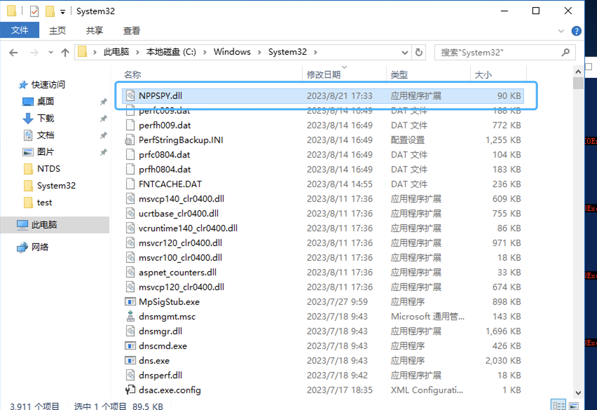
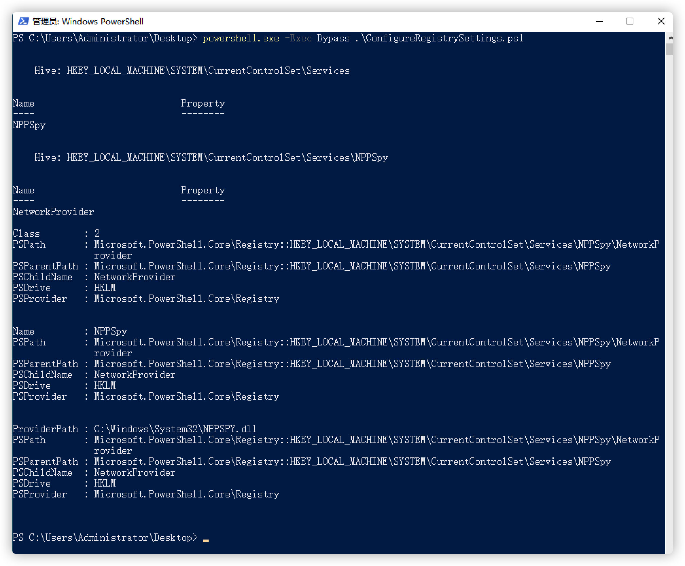
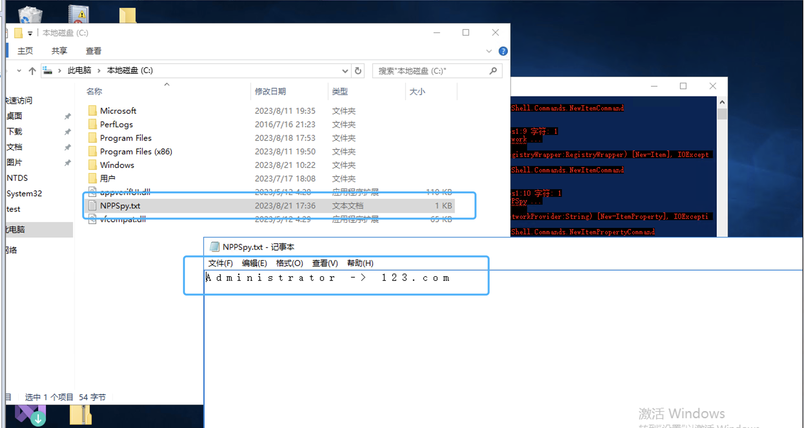
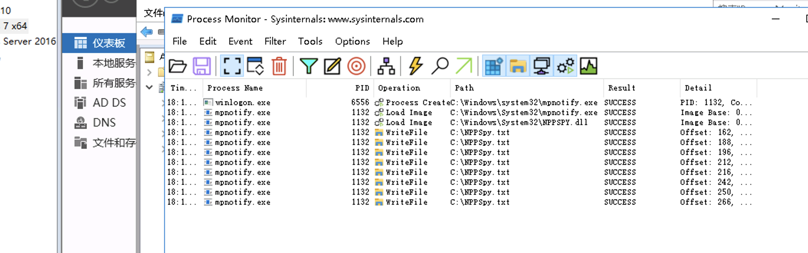

# win11 获取明文账户密码

一、场景复现 

payload来源：https://github.com/gtworek/PSBits/tree/master/PasswordStealing 

1、将生成的dll文件放置于C://windows/System32 文件夹下。



2、修改注册表

powershell.exe -Exec Bypass .\ConfigureRegistrySettings.ps1



3，注销账户

4，在打开c盘下的NPPSpy.txt文件



可以看到，已经获取到登陆的明文账号和密码。

二、原理分析

`Winlogon.exe`会检查`HKLM\SOFTWARE\Microsoft\Windows NT\CurrentVersion\Winlogon`的`mpnotify`值，然后启动对应的值的exe。如果为没有该字段，就运行 `mpnotify.exe`。然后 `mpnotify.exe` 读取注册表中`HKEY_LOCAL_MACHINE\SYSTEM\CurrentControlSet\Control\NetworkProvider\Order\ProviderOrder`的dll，然后打开RPC通道，winlogon与之绑定并把密码传递过去，`mpnotify.exe`再把该密码转发到dll中。

利用步骤：

1. 用户输入密码

2. winlogon 读取注册表 打开 mpnotify.exe

3. mpnotify 读取注册表对应的 dll，读取到了我们自己写的dll

   每个dll都提供了一种方式，用于通知不同的 window 组件关于身份认证相关的事件（比如登录、修改密码等）

4. mpnotify 打开 RPC 通道

5. winlogon 通过该通道发送认证信息

6. mpnotify 转发给 DLL

7. 我们的 DLL 获取到认证信息，把密码存储到硬盘中

   #### 进程加载过程如下



还原方法：

```powershell
$cleanupPath = Get-ItemProperty -Path "HKLM:\SYSTEM\CurrentControlSet\Control\NetworkProvider\Order" -Name PROVIDERORDER
$cleanupUpdatedValue = $cleanupPath.PROVIDERORDER 
$cleanupUpdatedValue = $cleanupUpdatedValue -replace ',NPPSpy',''
Set-ItemProperty -Path $cleanupPath.PSPath -Name "PROVIDERORDER" -Value $cleanupUpdatedValue
Remove-Item -Path "HKLM:\SYSTEM\CurrentControlSet\Services\NPPSpy" -Recurse -ErrorAction Ignore
Remove-Item C:\NPPSpy.txt -ErrorAction Ignore
Remove-Item C:\Windows\System32\NPPSpy.dll -ErrorAction Ignore
```

三、检测方法

