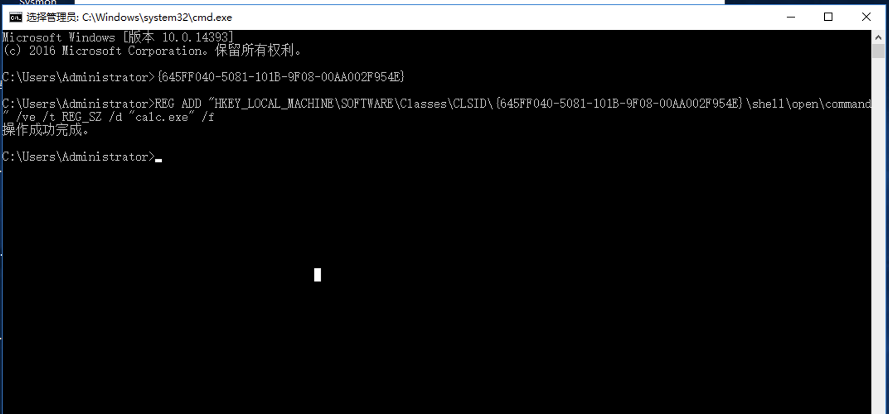
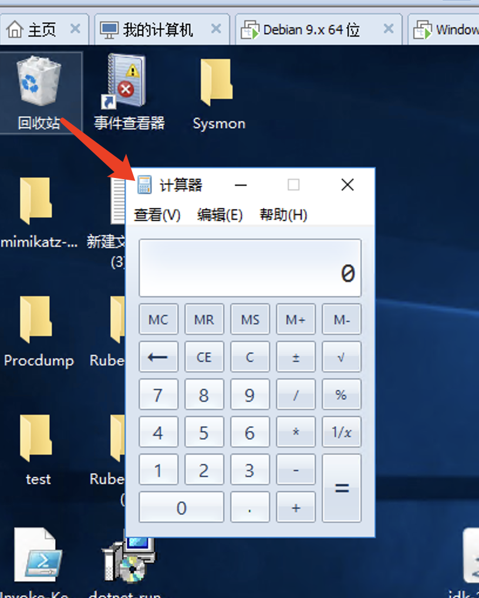
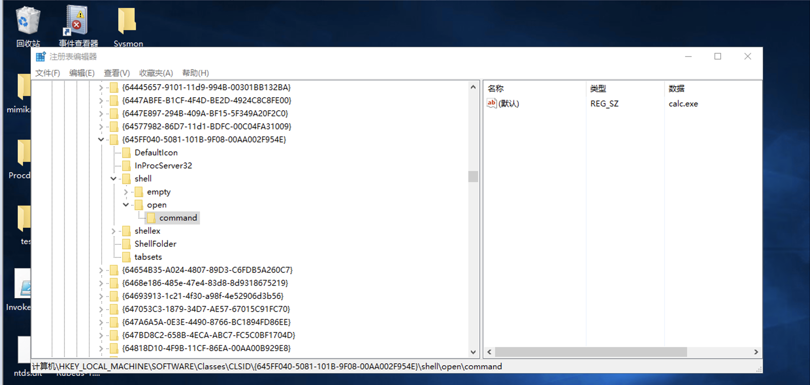
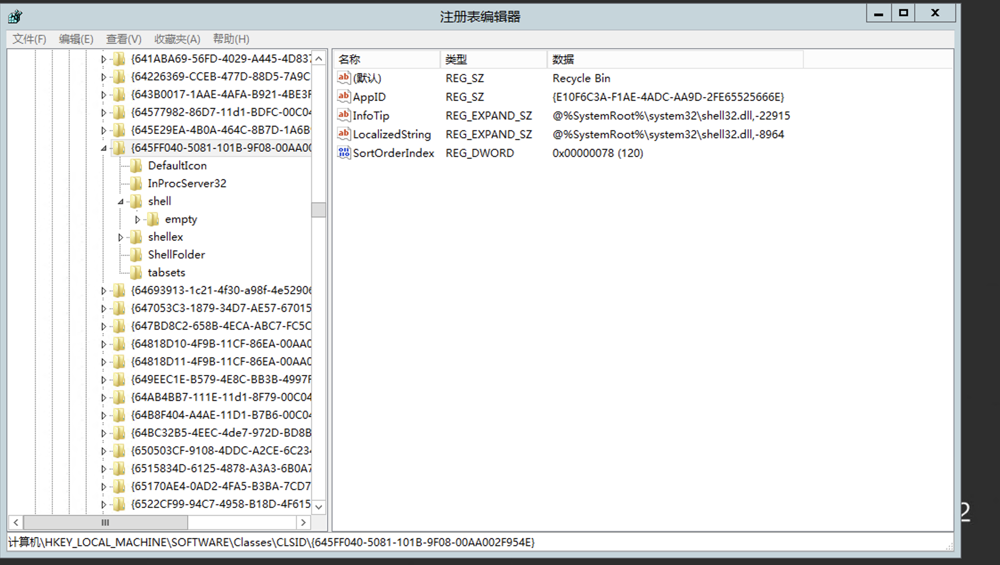
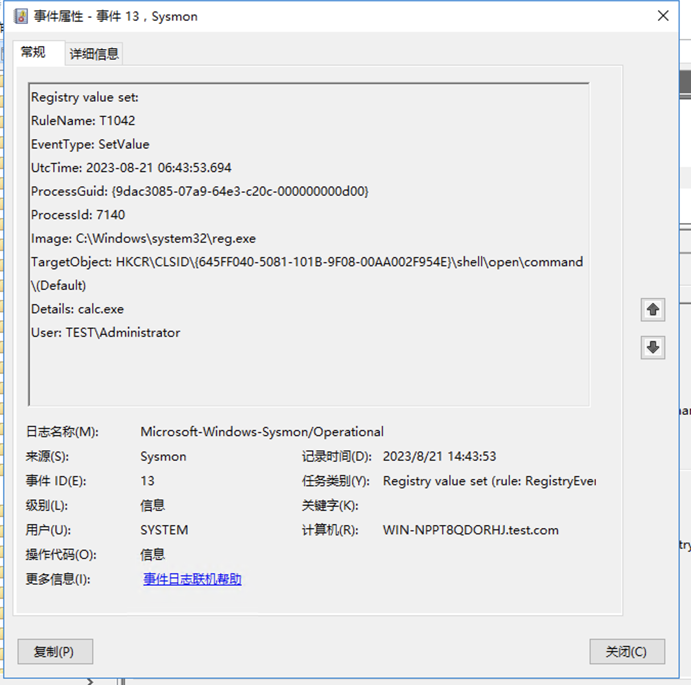

回收站注册表劫持

1、执行注册表修改命令

将calc.exe作为测试

2、双击回收站，弹出计算器

3、回收站相关注册表项

1）、HKEY_LOCAL_MACHINE\SOFTWARE\Classes\CLSID\{645FF040-5081-101B-9F08-00AA002F954E}\shell

2）、HKEY_CLASSES_ROOT\CLSID\{645FF040-5081-101B-9F08-00AA002F954E}\shell

修改后的注册表项如下图：

正常注册表项如下图：

在利用前后可以清晰的观测到在回收站的shell子项下增加了open/command项。

其中该项的默认值则为测试使用到的calc.exe。

4、检测思路

日志截图：

windows sysmon13

检测逻辑：

TargetObject: HKCR\CLSID\{645FF040-5081-101B-9F08-00AA002F954E}\shell\open\command\(Default)

AND

Details: 以.exe结尾

