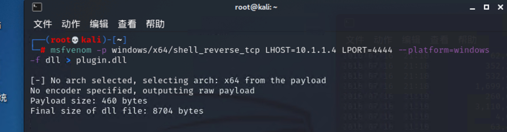
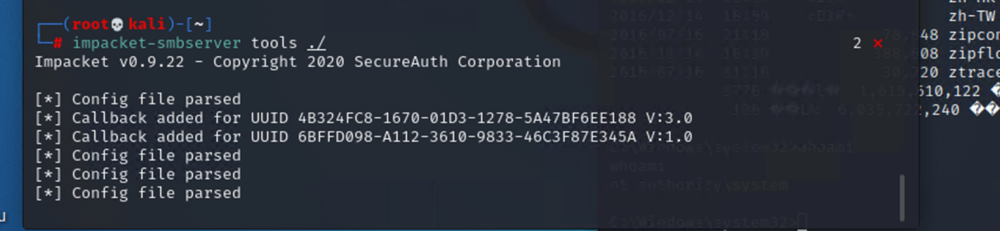
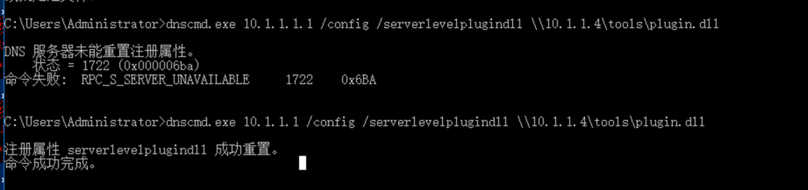
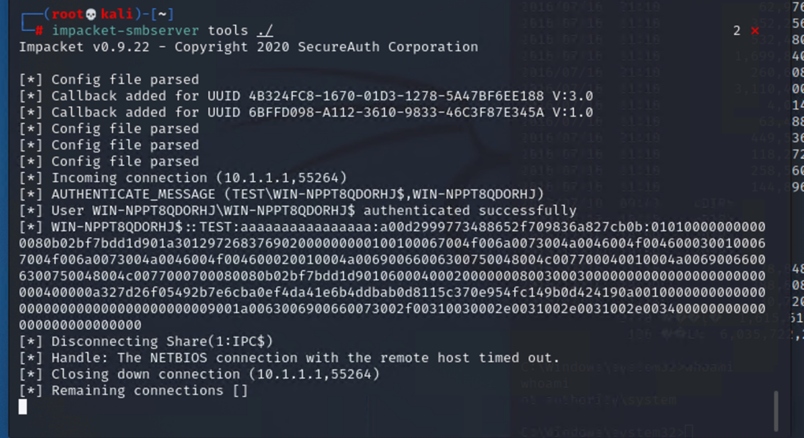
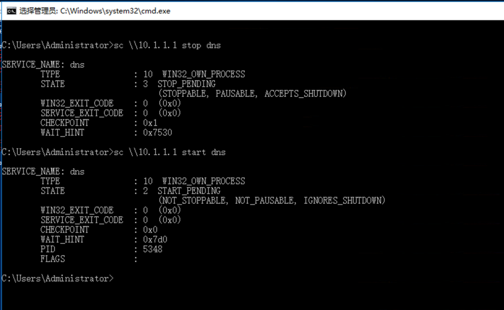
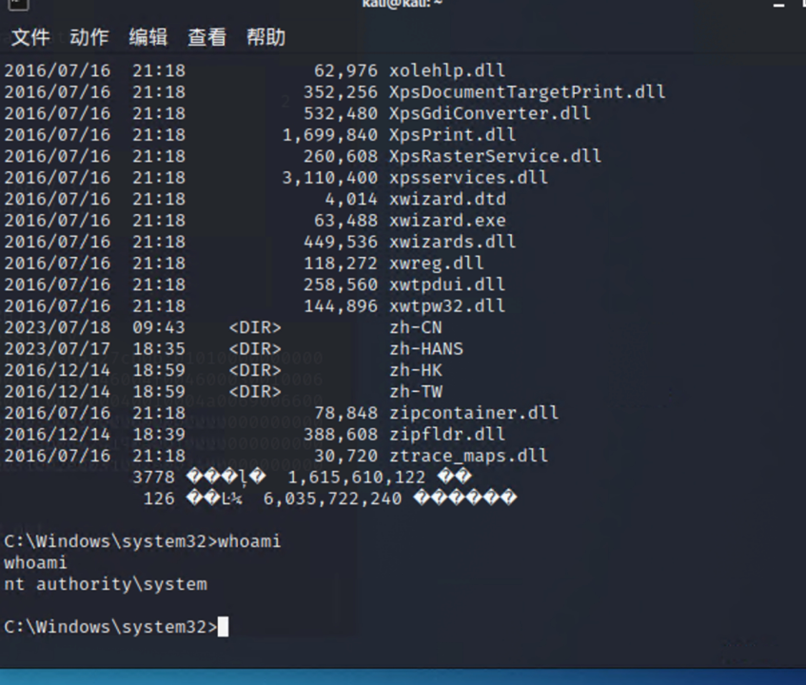
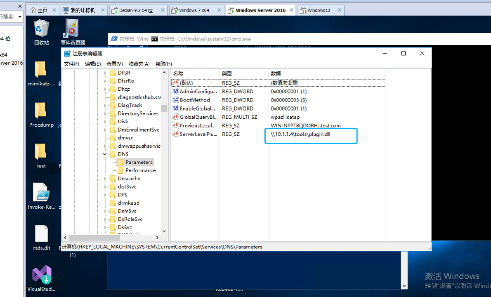
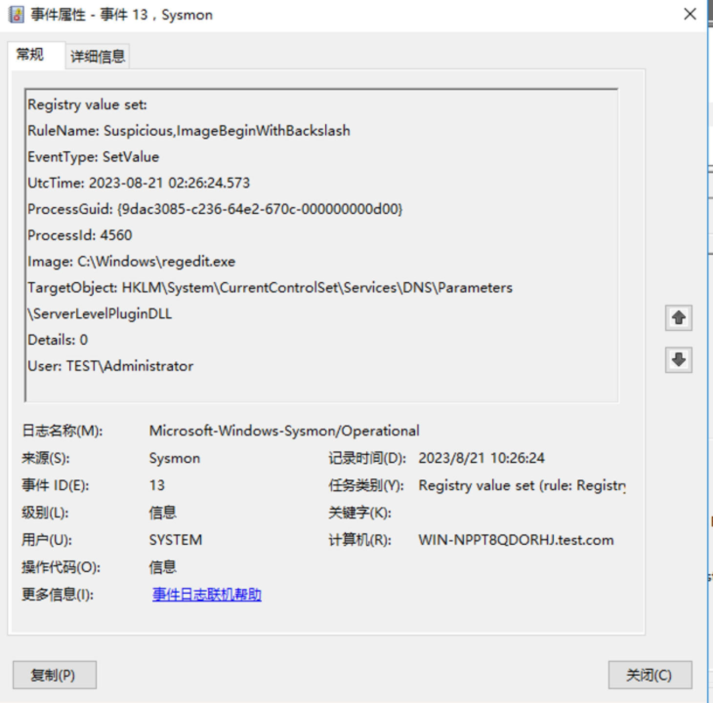

域渗透-dnscmd远程加载dll场景

 

1、复现过程

1）、生成payload

2）、开启smb服务端。

 

3)、利用dnscmd远程加载dll文件

 

4）、服务端文件传输成功

5）、重启dns服务器

6）、连接受害终端

7）、查看dns组册表项

 

 事件日志：

 

2、检测逻辑

 

event_id=1

（image以dnscmd.exe结尾 OR OriginaFileName:dnscmd.exe）AND commandline 以。DLL结尾

AND 

event_id = 13 

TargetObject: HKLM\System\CurrentControlSet\Services\DNS\Parameters\ServerLevelPluginDLL 

AND EventType: SetValue